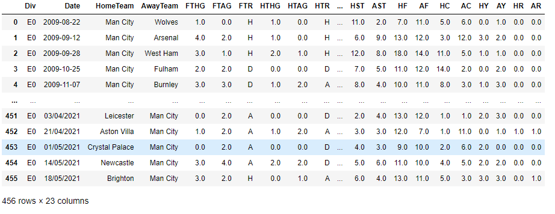
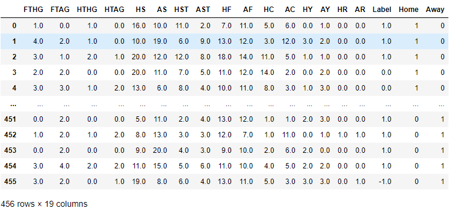
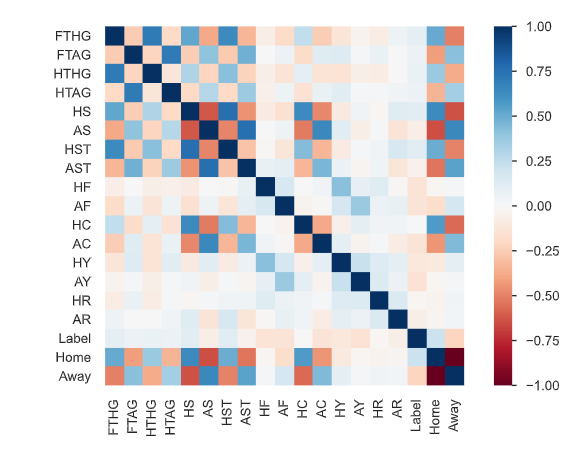

# DS-Project-5-EPL-Win_Predictor :soccer:
Created a model that predicts the chances of winning a premiere league football match for your favourite EPL team. 

* Designed a model that predicts the chances of winning a football :soccer: match for your favourite premiere league team.  
* Dataset - Scraped and fetched data from the resources provided below . The Dataset contains some important statistics for the last 12 seasons of English Premier League.
* Model - The major aim of in this project is to build a predictor that predicts the chances of winning a game based on the previous statistical data by using classification algorithms and techniques.

## Code and Resources Used ##
**Python Version:** 3.10.5  
**Packages:** pandas, pandas-profiling, numpy, sklearn, matplotlib, seaborn  
**For Web Framework Requirements:** _pip install -r requirements.txt_  
**Data Resources:** The Dataset is originally sourced from <http://www.football-data.co.uk/> but later I found out a Kaggle resource from which it was easier to fetch the data. <https://www.kaggle.com/datasets/lumierebatalong/english-premiere-league-team-datasets>

## About the Dataset ##
* Barclay premier league is the best :soccer: league in the world.It consists of the best 20 English football clubs that have qualified to fight for the title. 
* Every team plays every other team twice-once at home ground which is known as a **Home** game and once at the opponent's home ground which is termed as the **Away** game in a single calender year.
* The Kaggle Dataset consists of statistical data of the previous 12 seasons for 5 teams which have already won the title in the last 12 seasons namely **Man City, Liverpool, Man United, Chelsea, Leicester with two outsiders Arsenal and Tottenham**
 [Note: If your favourite team is not in the list, you can scrape the data from the source website linked above using libraries like BeautifulSoup or Selenium.]
 
#### Data Overview ####

The Features are defined as follows:

Div = League Division  
Date = Match Date (dd/mm/yy)  
HomeTeam = Home Team  
AwayTeam = Away Team  
FTHG = Full Time Home Team Goals  
FTAG = Full Time Away Team Goals  
FTR  = Full Time Result (H=Home Win, D=Draw, A=Away Win)  
HTHG = Half Time Home Team Goals  
HTAG = Half Time Away Team Goals  
HTR = Half Time Result (H=Home Win, D=Draw, A=Away Win)  
Referee = Match Referee  
HS = Home Team Shots  
AS = Away Team Shots  
HST = Home Team Shots on Target  
AST = Away Team Shots on Target  
HC = Home Team Corners  
AC = Away Team Corners  
HF = Home Team Fouls Committed  
AF = Away Team Fouls Committed  
HY = Home Team Yellow Cards  
AY = Away Team Yellow Cards  
HR = Home Team Red Cards  
AR = Away Team Red Cards  

#### Data Preprocessing and Cleaning ####
* Fortunately, we dont have any null values or missing values. We dont have to use an Imputer.
* I remove unneceassry attributes such as **Div ,Date,Referee**.
* Since I want to calculate the total number of wins,losses and draws for my team , I define a function that considers the HomeTeam,AwayTeam column and based on the 'FTR' which is the full time result, it returns me a list of wins,losses and draws for Man City. I add this list as a column which will later be the label for my model as I need to predict the end result of a game.
* Then I drop the 'FTR' column as I dont require it anymore.
* Finally, I manipulate the 'str' datatype features as an 'int' datatype. This is because a classifier gives us better results on 'int' datatype.    

This is how the data looks like after Preprocessing it:

## EDA - Exploratory data analysis ## 
* I looked at the distributions of the data and the value counts for thenumber of wins ,losses and draws.
* Statistical insights on this dataset using the pandas describe() function allows us to really dive into analytics of football and the performance of a club in football games. I am not really diving into the analytics part as our job is to focus on the ML model.  
* I also plotted a heatmap for the correlations between the features and label. 
* Besides this, I have also used the pandas-profiling library to generate full detailed EDA report on the dataset. Please find it in the repo for reference.

## Model Building ##

* I split the data into train and tests sets with a test size of 15%.
* After splitting, I stratefied shuffled the datasets to make sure there are similar ratios of the 'Label' attribute in both the testing and training datasets.
* Finally, I split the data into features and label

As I am creating a Win predictor , I manipulate my labels to return  **True** for Wins and **False** for losses and draws.
This is my binary condition for my classifier.

#### Creating a Pipeline ####
This is just to automate all my processes.  
I have added a **StandardScaler** for scaling my features and fit_transformed my features for the model.  
[Note: You can add all processes to this pipeline such as Imputers, etc.]  

#### Selecting and training a desired model for our predictor ####
I tried five different classifier models and evaluated them by calculating the Precision,Recall and F1-Score. I believe accuracy is not the best way to evaluate classifiers, therefore I calculated the F-1 scores for an accurate evaluation for our model.

The five different models I tried are:

1. LogisticRegression - This is the first approach i take to every classying problem as it is efficient. The feedback was average for this particular dataset.
2. GaussianNB - Naive Bayes classifiers are one of the best models for predictions. This gave me the best results.
3. RandomForestClassifier - Good with a lot of features. Performed the best on the training datasets with a very high f1-score of 91% but did not perform as good with the testing dataset.
4. DecisionTreeClassifier - Very similar performance as the RandomForestClassifier 
5. Support Vector Machine Classifier (SVM) - In short this finds the best hyperplane and splits the data. Had a similar f1-score as the RandomForestClassifier  

## Model Performance ##
The Gaussian Naive Bayes Classifier performed the best  on the test and validation sets.I found out the Precision,Recall and F1-Scores for all the models. This gives us a proper evaluation of the model.
Below are the highlights of how the GaussianNB model performed :  
             **Precision_score - 0.7241379310344828**  
            **Recall_score - 0.9333333333333333**  
             **F1_Score - 0.8155339805825242**   

