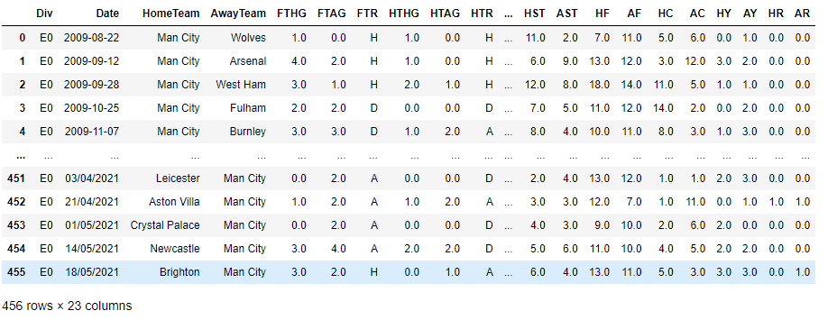

# DS-Project-5-EPL-Win_Predictor :soccer:
Created a model that predicts the chances of winning a premiere league football match for your favourite EPL team. 

* Designed a model that predicts the chances of winning a football :soccer: match for your favourite premiere league team.  
* Dataset - Scraped and fetched data from the resources provided below . The Dataset contains some important statistics for the last 12 seasons of English Premier League.
* Model - The major aim of in this project is to build a predictor that predicts the chances of winning a game based on the previous statistical data by using classification algorithms and techniques.

## Code and Resources Used ##
**Python Version:** 3.10.5  
**Packages:** pandas, pandas-profiling, numpy, sklearn, matplotlib, seaborn  
**For Web Framework Requirements:** _pip install -r requirements.txt_  
**Data Resources:** The Dataset is originally sourced from <http://www.football-data.co.uk/> but later I found out a Kaggle resource from which it was easier to fetch the data. <https://www.kaggle.com/datasets/lumierebatalong/english-premiere-league-team-datasets>

## About the Dataset ##
* Barclay premier league is the best :soccer: league in the world.It consists of the best 20 English football clubs that have qualified to fight for the title. 
* Every team plays every other team twice-once at home ground which is known as a **Home** game and once at the opponent's home ground which is termed as the **Away** game in a single calender year.
* The Kaggle Dataset consists of statistical data of the previous 12 seasons for 5 teams which have already won the title in the last 12 seasons namely **Man City, Liverpool, Man United, Chelsea, Leicester with two outsiders Arsenal and Tottenham**
 [Note: If your favourite team is not in the list, you can scrape the data from the source website linked above using libraries like BeautifulSoup or Selenium.]
 
#### Data Overview ####

The Features are defined as follows:

Div = League Division  
Date = Match Date (dd/mm/yy)  
Time = Time of match kick off  
HomeTeam = Home Team  
AwayTeam = Away Team  
FTHG and HG = Full Time Home Team Goals  
FTAG and AG = Full Time Away Team Goals  
FTR and Res = Full Time Result (H=Home Win, D=Draw, A=Away Win)  
HTHG = Half Time Home Team Goals  
HTAG = Half Time Away Team Goals  
HTR = Half Time Result (H=Home Win, D=Draw, A=Away Win)  
Referee = Match Referee  
HS = Home Team Shots  
AS = Away Team Shots  
HST = Home Team Shots on Target  
AST = Away Team Shots on Target  
HC = Home Team Corners  
AC = Away Team Corners  
HF = Home Team Fouls Committed  
AF = Away Team Fouls Committed  
HFKC = Home Team Free Kicks Conceded  
AFKC = Away Team Free Kicks Conceded  
HO = Home Team Offsides  
AO = Away Team Offsides  
HY = Home Team Yellow Cards  
AY = Away Team Yellow Cards  
HR = Home Team Red Cards  
AR = Away Team Red Cards  

## EDA - Exploratory data analysis ## 
I looked at the distributions of the data and the value counts for the various categorical variables. I also plotted graphs and heatmaps for correlations between the features and label. Below are a few highlights.

## Model Building ##
I also split the data into train and tests sets with a test size of 20%.

I tried three different models and evaluated them using Mean Absolute Error. I chose MAE because it is relatively easy to interpret and outliers aren’t particularly bad in for this type of model.

I tried three different models:

Multiple Linear Regression – Baseline for the model
DecisionTree Regression – Because of the sparse data from the many categorical variables, I thought a normalized regression like DecisionTree would be effective.
Random Forest – Again, with the sparsity associated with the data, I thought that this would be a good fit.

## Model Performance ##
The Random Forest Regression model outperformed the other approaches on the test and validation sets.I found out the Mean and the Standard Deviation for all the three models. This basically gives us an image by how much percentage can the predictions be off the actual prediction.
* **Multiple Linear Regression:**   Mean- 5.028337074958086 , Standard Deviation- 1.056869119278954
* **Decision Tree Regression:** Mean- 4.256820741921791,
   Standard Deviation- 1.1575140416039331
* **Random Forest Regression:** Mean- 3.304827981052571, 
   Standard Deviation- 0.6490112395533792  
The results were pretty good since in the worst case scenario,our predictions would only be off by a meager 3.65%.
